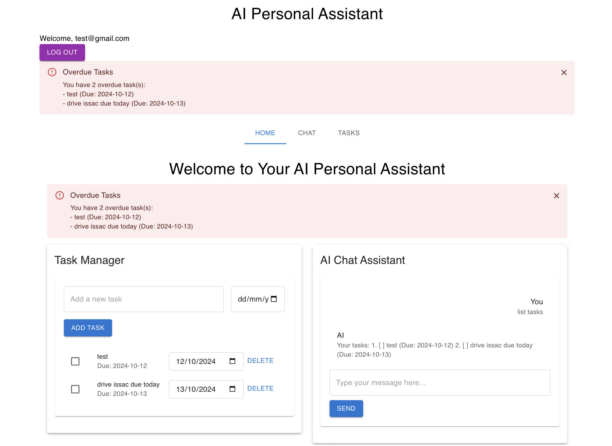

# AI Personal Assistant



This project is a full-stack **AI Personal Assistant** application that consists of a **frontend** built with React and a **backend** using Express and the OpenAI API. The personal assistant responds to user input, providing AI-generated responses using OpenAI's language model.

## Features

- **AI Response Generation**: The backend communicates with the OpenAI API to generate responses based on user input.
- **Full-Stack Application**: The project consists of both a React frontend and an Express backend.
- **Environment Variables**: API keys and other sensitive data are managed using environment variables.
- **Express API**: The backend exposes an API that the frontend uses to retrieve responses from OpenAI.

## Technology Stack

- **Frontend**: 
  - React.js
  - TypeScript
  - CSS (SCSS or regular)
  
- **Backend**: 
  - Node.js with Express
  - TypeScript
  - OpenAI API for AI-generated responses
  - CORS and dotenv for configuration and cross-origin support

## Installation Guide

### Prerequisites

Make sure you have the following installed:

- **Node.js**: Download it from [here](https://nodejs.org/).
- **npm** or **yarn**: Node's package managers.
- **OpenAI API Key**: You'll need to sign up for an OpenAI API key [here](https://beta.openai.com/signup/).

### Steps

#### Backend Setup

1. **Clone the Repository**:
   ```bash
   git clone https://github.com/yourusername/ai-personal-assistant.git
   cd ai-personal-assistant/backend
   ```

2. **Install Backend Dependencies**:
   ```bash
   npm install
   ```
   or if you use Yarn:
   ```bash
   yarn install
   ```

3. **Set up Environment Variables**:
   - Create a `.env` file in the `backend` directory and add your OpenAI API key:
     ```
     OPENAI_API_KEY=your_openai_api_key
     PORT=3001
     ```

4. **Run the Backend**:
   Start the backend server:
   ```bash
   npm run start
   ```
   or for Yarn:
   ```bash
   yarn start
   ```

   The server should now be running at `http://localhost:3001`.

#### Frontend Setup

1. **Navigate to the Frontend Directory**:
   ```bash
   cd ../frontend
   ```

2. **Install Frontend Dependencies**:
   Install the required dependencies for the React frontend:
   ```bash
   npm install
   ```
   or:
   ```bash
   yarn install
   ```

3. **Run the Frontend**:
   Start the frontend React application:
   ```bash
   npm start
   ```
   or:
   ```bash
   yarn start
   ```

   The frontend should be running at `http://localhost:3000`.

### File Structure

```plaintext
ai-personal-assistant/
├── backend/
│   ├── openai.ts           # OpenAI API interaction logic
│   ├── server.ts           # Express server setup and API routes
│   ├── package.json        # Backend dependencies and scripts
│   └── .env                # Environment variables (not committed)
├── frontend/
│   ├── App.tsx             # Main React app component
│   ├── components/         # Reusable React components
│   ├── index.tsx           # React entry point
│   ├── index.css           # Global CSS styles
│   ├── package.json        # Frontend dependencies and scripts
└── README.md               # Project documentation
```

### Backend Overview

- **openai.ts**: This file interacts with the OpenAI API to generate AI responses based on user input. It uses environment variables for secure API key storage.
  ```typescript
  const openai = new OpenAI({
    apiKey: process.env.OPENAI_API_KEY,
  });

  export async function generateResponse(userInput: string): Promise<string> {
    try {
      const completion = await openai.completions.create({
        model: 'text-davinci-003',
        prompt: userInput,
      });
      return completion.choices[0].text.trim();
    } catch (error) {
      console.error('Error generating response:', error);
      return 'Sorry, something went wrong.';
    }
  }
  ```

- **server.ts**: This file sets up an Express server that handles requests and uses the `generateResponse` function from `openai.ts`. CORS is enabled to allow requests from the frontend.
  ```typescript
  const app = express();
  const port = process.env.PORT || 3001;

  app.use(cors());
  app.use(express.json());

  app.post('/api/generate', async (req, res) => {
    const { userInput } = req.body;
    const response = await generateResponse(userInput);
    res.json({ response });
  });

  app.listen(port, () => {
    console.log(`Server is running on port ${port}`);
  });
  ```

### Frontend Overview

- **App.tsx**: This is the main React component where users can input their questions, and the AI's response is displayed after the request is sent to the backend.
  ```typescript
  const handleSubmit = async () => {
    const res = await fetch('http://localhost:3001/api/generate', {
      method: 'POST',
      headers: {
        'Content-Type': 'application/json',
      },
      body: JSON.stringify({ userInput }),
    });
    const data = await res.json();
    setResponse(data.response);
  };
  ```

### Customization

- **Backend**: You can customize the prompt and response format by modifying the OpenAI call in `openai.ts`.
- **Frontend**: Modify the UI by updating the components in the `components/` folder.

### License

This project is licensed under the MIT License.